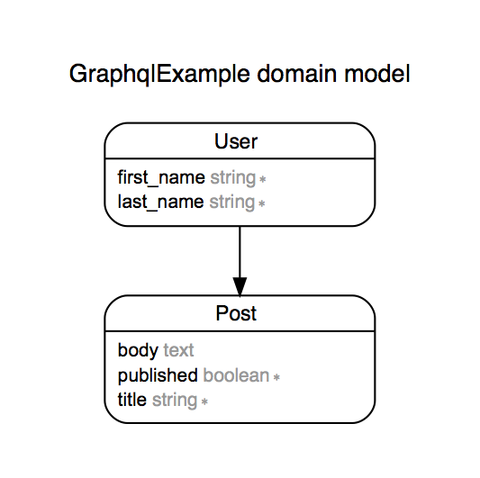

# GraphQL Example

## Starting Point

The `master` branch is a barebones Rails app that has two models:

  

A `user` has many `posts`.
A `post` belongs to a `user`.

## To Do:

1. Install `graphql` gem (https://github.com/rmosolgo/graphql-ruby)

1. Add a `users` query that returns a list of users.

1. Add a `posts` field to the user type to allow you to list posts for an individual user.

1. Add a `createPost` mutation to allow you to create a post via GraphQL

1. Bonus: Add a query for a single user.

